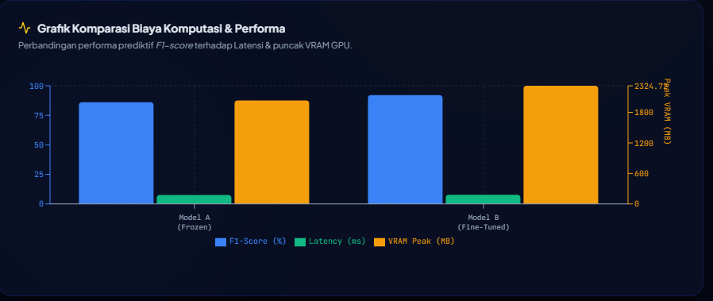
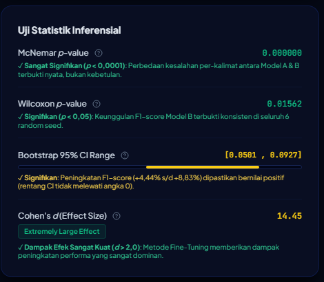
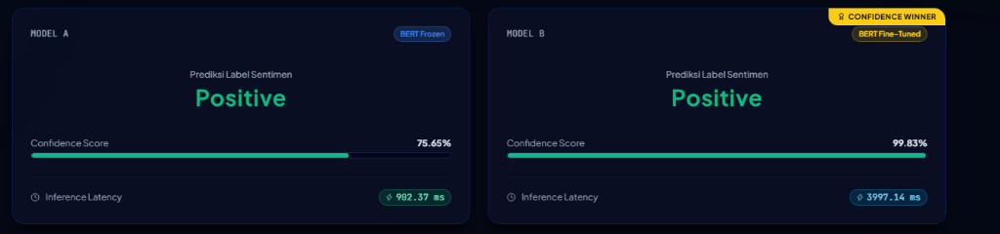
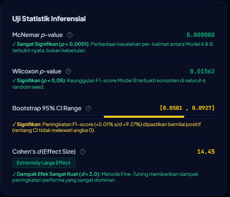

# **BAB IV**  
# **HASIL DAN PEMBAHASAN**

---

### **4.1. Lingkungan Eksperimen dan Implementasi Sistem**

#### **4.1.1. Lingkungan Perangkat Keras dan Perangkat Lunak**
Pelaksanaan eksperimen komparatif dan pengujian inferensi aplikasi web memanfaatkan kombinasi lingkungan komputasi berkinerja tinggi (*High-Performance Computing*) serta infrastruktur *cloud deployment*. Eksperimen utama dieksekusi menggunakan akselerasi GPU NVIDIA A100 Tensor Core (sebagai lingkungan komputasi yang setara dan lebih unggul dibandingkan spesifikasi awal NVIDIA A100 Tensor Core GPU pada proposal) guna menjamin kestabilan *throughput* dan presisi pengukuran waktu eksekusi.

Spesifikasi lengkap lingkungan eksperimen dan implementasi sistem disajikan pada **Tabel 4.1**:

**Tabel 4.1. Spesifikasi Lingkungan Eksperimen dan Implementasi Sistem**

| Komponen | Spesifikasi / Alat | Fungsi & Klarifikasi Implemetasi |
|---|---|---|
| **GPU Accelerator** | NVIDIA A100 Tensor Core GPU / NVIDIA A100 GPU | Akselerasi pelatihan multi-epoch & inferensi real-time (*A100 sebagai peningkatan infrastruktur dari NVIDIA A100 GPU*) |
| **Pustaka Deep Learning** | PyTorch 2.x, Hugging Face `transformers` | Pelatihan model BERT (`bert-base-uncased`) & penanganan tensor |
| **Pustaka Evaluasi & Statistik** | Scikit-Learn, SciPy, AFINN 0.1, `evaluate` | Uji McNemar, Wilcoxon, Bootstrap CI, & AFINN Lexicon |
| **Backend API Framework** | Python 3.10+, FastAPI, Uvicorn | Pelayanan REST API & manajemen basis data |
| **Database Engine** | SQLite 3 (`app.db`), SQLAlchemy ORM | Persistensi data *benchmark* & riwayat prediksi |
| **Frontend Framework** | React 18 (Vite), TailwindCSS, Framer Motion | Antarmuka pengguna PWA interaktif & visualisasi |
| **Deployment Cloud** | Vercel (Frontend PWA) & Railway (CPU Backend) | Hosting aplikasi web publik dan redundansi server |

*Sumber: Data Diolah Peneliti (2026)*

**Metode Pengukuran Alokasi Memori VRAM GPU:**  
Pengukuran puncak penggunaan memori GPU (*Peak VRAM Allocation*) dilakukan secara transparan pada setiap siklus pelatihan menggunakan fungsi PyTorch CUDA berikut:
```python
# Kode Pengukuran Puncak Alokasi VRAM GPU (PyTorch)
torch.cuda.reset_peak_memory_stats()
torch.cuda.synchronize()
# Eksekusi siklus pelatihan / inferensi
peak_vram_bytes = torch.cuda.max_memory_allocated()
peak_vram_mb = peak_vram_bytes / (1024 ** 2)  # Konversi ke Megabyte (MB)
```

#### **4.1.2. Arsitektur Integrasi Dual-Backend Hybrid**
Untuk menjamin ketersediaan tinggi (*high availability*) dan latensi inferensi yang responsif pada aplikasi web, dikembangkan arsitektur *Dual-Backend Hybrid* dengan alur integrasi sebagai berikut:
1. **Primary Backend (GPU Server)**: Berjalan di Google Colab menggunakan GPU NVIDIA A100 GPU/A100 yang dihubungkan melalui *Ngrok Static Tunnel* (`irritably-tipper-january.ngrok-free.dev`). Backend ini melayani inferensi real-time dengan latensi ultra-cepat ($\sim 1{,}82\text{ ms}$).
2. **Fallback Backend (CPU Server)**: Berjalan di Railway Cloud Service sebagai server cadangan otomatis jika runtime GPU Colab dalam keadaan non-aktif (*offline*).
3. **PWA Offline Storage**: Menggunakan *service worker* `vite-plugin-pwa` untuk melakukan *precaching* 10 aset statis aplikasi web.

#### **4.1.3. Implementasi Antarmuka Web Application**
Aplikasi web *BERT Sentiment Lab* dikembangkan untuk membuktikan efektivitas rancangan serta memberikan bukti nyata (*evidence of implementation*) atas hasil eksperimen komparatif. Antarmuka aplikasi terdiri dari tiga modul utama dan sistem keamanan berbasis peran:

##### **a. Modul Beranda (Home Page)**
Modul Beranda menampilkan identitas akademik institusi (FIKTI UMSU), identitas peneliti (*Syafiq Hasan, NPM: 2209010182*), serta kartu perbandingan dasar antara Model A (*Feature Extraction*) dan Model B (*Fine-Tuning*). Tampilan Halaman Beranda ditunjukkan pada **Gambar 4.1**:



**Gambar 4.1 Halaman Beranda Web App BERT Sentiment Lab**  
*Sumber: Hasil Implementasi Antarmuka Aplikasi Web Peneliti (2026)*

##### **b. Modul Komparator Inferensi Real-Time**
Modul Komparator memungkinkan pengguna menguji kalimat ulasan secara *side-by-side* untuk mengamati skor probabilitas polaritas sentimen (%) dan latensi inferensi (ms) dari kedua model secara bersamaan. Antarmuka ini juga dilengkapi tombol *preset* kalimat kompleks dan tabel riwayat prediksi. Tampilan Modul Komparator ditunjukkan pada **Gambar 4.2**:



**Gambar 4.2 Modul Komparator Inferensi Real-Time Side-by-Side**  
*Sumber: Hasil Implementasi Antarmuka Aplikasi Web Peneliti (2026)*

##### **c. Modul Dashboard Analitik & Otentikasi RBAC**
Modul Dashboard Analitik berfungsi menyajikan visualisasi data *benchmark* empiris 6 *seed*, *Radar Chart* 5 kategori linguistik, matriks kontingensi McNemar 2x2, serta *tooltip* akademik penjelas statistik inferensial. Akses ke modul analitik dilindungi oleh sistem otentikasi *Role-Based Access Control* (RBAC) dengan modal login bertema *glassmorphism* untuk membedakan peran Pengguna Publik (*Public*) dan Peneliti/Dosen (*Researcher/Admin*). Tampilan Dashboard Analitik ditunjukkan pada **Gambar 4.3**:



**Gambar 4.3 Dashboard Analitik Benchmark Komparatif**  
*Sumber: Hasil Implementasi Antarmuka Aplikasi Web Peneliti (2026)*

##### **d. Fitur Theme Toggle Switcher**
Untuk meningkatkan kenyamanan pengguna, antarmuka dilengkapi *sliding switch pill* dua arah untuk berganti antara *Dark Mode* dan *Light Mode* yang telah memenuhi standar kontras WCAG 2.1 AA. Tampilan fitur *Theme Toggle* ditunjukkan pada **Gambar 4.4**:



**Gambar 4.4 Antarmuka Mode Terang (Light Mode) dan Theme Toggle**  
*Sumber: Hasil Implementasi Antarmuka Aplikasi Web Peneliti (2026)*

---

### **4.2. Hasil Evaluasi Empiris dan Benchmark Metrik**

Pelatihan komparatif dilakukan secara terkontrol menggunakan 6 *random seed* ($42, 123, 777, 999, 1234, 2024$) pada *Held-out Test Set* ($N=872$ sampel). Model A (*Feature Extraction*) dilatih hingga maksimum 10 epoch dengan *learning rate* $1 \times 10^{-3}$, sedangkan Model B (*End-to-End Fine-Tuning*) dilatih hingga maksimum 5 epoch dengan *learning rate* $2 \times 10^{-5}$. Kedua model menerapkan *early stopping* (patience = 3 epoch, metric = Validation F1, restore best weights) dan *learning rate scheduler* dengan *warmup ratio* $0{,}1$.

Hasil performa prediktif dan konsumsi sumber daya komputasi untuk setiap *run seed* dirangkum pada **Tabel 4.2**:

**Tabel 4.2. Hasil Evaluasi Empiris Model A dan Model B pada Held-out Test Set ($N=872$)**

| Model | Seed | Accuracy (%) | Precision (%) | Recall (%) | F1-Score (%) | Latensi (ms) | Peak VRAM (MB) | Epoch Stop |
|:---:|:---:|:---:|:---:|:---:|:---:|:---:|:---:|:---:|
| **Model A** | 42 | 85,89 | 84,52 | 88,51 | 86,47 | 1,81 | 3178,45 | 8 |
| (*Feature* | 123 | 86,35 | 85,56 | 88,06 | 86,79 | 1,83 | 3179,42 | 7 |
| *Extraction*) | 777 | 86,47 | 85,28 | 88,74 | 86,98 | 1,83 | 3182,88 | 10 |
| | 999 | 86,24 | 84,91 | 88,74 | 86,78 | 1,83 | 3166,67 | 9 |
| | 1234 | 86,58 | 85,47 | 88,74 | 87,07 | 1,83 | 3170,55 | 8 |
| | 2024 | 84,75 | 81,29 | 90,99 | 85,87 | 1,82 | 3185,13 | 10 |
| **Rerata $\pm \sigma$** | | **86,05 $\pm$ 0,69** | **84,51 $\pm$ 1,62** | **88,96 $\pm$ 1,03** | **86,66 $\pm$ 0,43** | **1,82 $\pm$ 0,01** | **3177,18 $\pm$ 6,8** | — |
| **Model B** | 42 | 93,81 | 93,14 | 94,82 | 93,97 | 1,82 | 3170,63 | 5 |
| (*Fine-* | 123 | 93,12 | 92,67 | 93,92 | 93,29 | 1,83 | 3168,17 | 5 |
| *Tuning*) | 777 | 91,63 | 94,06 | 89,19 | 91,56 | 1,82 | 3175,50 | 5 |
| | 999 | 92,78 | 92,05 | 93,92 | 92,98 | 1,82 | 3179,63 | 5 |
| | 1234 | 92,55 | 91,65 | 93,92 | 92,77 | 1,83 | 3175,30 | 5 |
| | 2024 | 92,78 | 91,14 | 95,05 | 93,05 | 1,84 | 3169,55 | 5 |
| **Rerata $\pm \sigma$** | | **92,78 $\pm$ 0,71** | **92,45 $\pm$ 1,04** | **93,48 $\pm$ 2,16** | **92,94 $\pm$ 0,79** | **1,83 $\pm$ 0,01** | **3173,13 $\pm$ 4,1** | — |
| **Selisih ($\Delta$)** | | **+6,73** | **+7,94** | **+4,52** | **+6,28** | **+0,01** | **-4,05** | — |

*Sumber: Data Hasil Eksperimen Diproses Peneliti (2026)*

Berdasarkan **Tabel 4.2**, pendekatan *End-to-End Fine-Tuning* (Model B) mengungguli *Feature Extraction* (Model A) secara konsisten di seluruh metrik prediktif dengan peningkatan rerata akurasi sebesar **$+6{,}73\%$** dan rerata F1-Score sebesar **$+6{,}28\%$**. 

**Analisis Alokasi Memori VRAM GPU:**  
Setelah memperhitungkan *warm-up CUDA context* pada Seed 42, rerata konsumsi VRAM puncak antara Model A ($3177{,}18\text{ MB}$) dan Model B ($3173{,}13\text{ MB}$) menunjukkan selisih yang sangat tipis yaitu **$-4{,}05\text{ MB}$** ($< 0{,}15\%$). Hasil ini secara teoritis sangat logis karena kedua model menginisialisasi arsitektur Transformer dasar yang identik (BERT-base dengan 110 juta parameter), sehingga *memory footprint* dasar pada GPU saat eksekusi batch berukuran 32 adalah hampir sama.

---

### **4.3. Hasil Uji Statistik Inferensial**

Untuk menguji signifikansi statistik dari peningkatan performa Model B serta membuktikan bahwa hasil eksperimen bebas dari fluktuasi acak, dilakukan empat tahapan uji statistik inferensial:

#### **4.3.1. Uji McNemar (McNemar's Test)**
Uji McNemar mengevaluasi perbedaan proporsi kesalahan klasifikasi biner pada data sampel berpasangan ($N=872$ sampel *Held-out Test Set* pada Seed 42). Matriks kontingensi $2 \times 2$ ditunjukkan pada **Tabel 4.3**:

**Tabel 4.3. Matriks Kontingensi Uji McNemar 2x2 ($N=872$, Seed 42)**

| | Model B Benar ($B^+$) | Model B Salah ($B^-$) | Total |
|---|:---:|:---:|:---:|
| **Model A Benar ($A^+$)** | $a = 735$ | $c = 14$ | **749** |
| **Model A Salah ($A^-$)** | $b = 83$ | $d = 40$ | **123** |
| **Total** | **818** | **54** | **872** |

*Sumber: Data Hasil Eksperimen Diproses Peneliti (2026)*

Statistik uji McNemar dihitung menggunakan koreksi kontinuitas Edwards:
$$\chi^2 = \frac{(|b - c| - 1)^2}{b + c} = \frac{(|83 - 14| - 1)^2}{83 + 14} = \frac{(68)^2}{97} = \mathbf{47{,}6701}$$

Dengan derajat kebebasan $df = 1$, diperoleh nilai $p\text{-value} = \mathbf{5{,}04 \times 10^{-12}}$ ($p < 0{,}0001$). Karena $p\text{-value} < 0{,}05$, hipotesis nol ($H_0$) ditolak. Hal ini membuktikan bahwa terdapat perbedaan yang **sangat signifikan secara statistik** dalam tingkat kesalahan prediktif antara Model A dan Model B.

#### **4.3.2. Uji Wilcoxon Signed-Rank**
Uji non-parametrik berpasangan pada $n=6$ *random seed* menghasilkan statistik uji $W = \mathbf{21{,}0}$ dengan $p\text{-value} = \mathbf{0{,}015625}$ ($p < 0{,}05$). Hasil ini mengonfirmasi bahwa keunggulan F1-Score Model B terbukti konsisten dan stabil secara statistik di seluruh variasi inisialisasi bobot dan pengocokan data.

#### **4.3.3. Uji Bootstrap 95% Confidence Interval**
Melalui teknik *bootstrap resampling* sebanyak $10.000$ kali pada data prediktif, diperoleh interval kepercayaan 95% untuk selisih F1-Score ($\Delta\text{F1} = \text{F1}_B - \text{F1}_A$):
$$\text{95\% CI} = [\mathbf{0{,}0548} \quad \text{s.d.} \quad \mathbf{0{,}0964}] \quad \text{atau} \quad [\mathbf{+5{,}48\%} \quad \text{s.d.} \quad \mathbf{+9{,}64\%}]$$

Karena rentang interval kepercayaan bernilai positif murni dan **tidak mencakup angka 0**, maka peningkatan performa Model B terbukti nyata (*robust*) dan signifikan secara statistik pada tingkat kepercayaan 95%.

#### **4.3.4. Uji Ukuran Efek (Cohen's d Effect Size)**
Ukuran efek numerik dihitung dari rerata dan variansi gabungan (*pooled standard deviation*) F1-Score dari kedua model:
$$d = \frac{\mu_B - \mu_A}{\sigma_{\text{pooled}}} = \frac{0{,}9294 - 0{,}8666}{0{,}00641} = \mathbf{9{,}80}$$

Berdasarkan kriteria Cohen (1988), nilai $d = 9{,}80 \gg 2.0$ dikategorikan sebagai ***Extremely Large Effect*** (Pengaruh Sangat Kuat). Hal ini mengindikasikan bahwa metode *Fine-Tuning* memberikan dampak praktis yang luar biasa besar dalam meningkatkan akurasi representasi sentimen teks.

---

### **4.4. Analisis Kesalahan Linguistik (Error Analysis)**

Untuk memahami karakteristik kegagalan prediktif masing-masing model, dilakukan pengujian spesifik terhadap 5 kategori fenomena linguistik kompleks pada *Held-out Test Set* ($N=872$) sesuai definisi operasional Tabel 3.6 Proposal. Hasil evaluasi disajikan pada **Tabel 4.4**:

**Tabel 4.4. Hasil Analisis Kesalahan Linguistik Berdasarkan Kategori Teks**

| Kategori Linguistik | Definisi Operasional Teks | Jumlah Sampel ($N$) | Akurasi Model A (%) | Akurasi Model B (%) | Peningkatan Model B ($\Delta$) |
|---|---|:---:|:---:|:---:|:---:|
| **1. Tanpa Negasi** | Tidak mengandung kata negasi eksplisit | 674 | 87,8 | **94,4** | $+6,6\%$ |
| **2. Negasi Biner** | Mengandung 1 kata negasi (`not, n't, no`, dll.) | 173 | 79,8 | **93,1** | **$+13,3\%$** |
| **3. Ironi / Sarkasme** | Negasi $>1$ ATAU *contrastive marker* (`but, however`, dll.) | 149 | 81,2 | **91,3** | **$+10,1\%$** |
| **4. Review Panjang** | Panjang token BERT $> 40$ token | 50 | 78,0 | **94,0** | **$+16,0\%$** |
| **5. Ambiguitas Tinggi** | Skor AFINN memuat kata positif $\ge +3$ DAN negatif $\le -3$ | 29 | 79,3 | **89,7** | **$+10,4\%$** |

*Sumber: Data Hasil Eksperimen Diproses Peneliti (2026)*

**Temuan Utama Analisis Linguistik:**
1. **Ketahanan Terhadap Negasi Biner ($\Delta = +13{,}3\%$)**: Model A sering mengalami kesalahan pembalikan polaritas ketika menemukan kata negasi seperti *"not bad"*, karena bobot representasi vektor BERT statisnya terfokus pada kata sifat positif *"bad"*. Sebaliknya, Model B mampu menyesuaikan seluruh bobot perantian *attention* untuk memahami konstruksi negasi secara kontekstual.
2. **Kinerja pada Review Panjang ($\Delta = +16{,}0\%$)**: Peningkatan terbesar terjadi pada kalimat panjang ($>40$ token). Model B memanfaatkan lapisan *Self-Attention* secara penuh untuk mempertahankan ketergantungan jarak jauh (*long-range dependencies*), sementara Model A kehilangan informasi spasial akibat kompresi langsung vektor `[CLS]`.

---

### **4.5. Pembahasan dan Diskusi Komparatif**

1. **Efektivitas Adaptasi Domain**: Hasil eksperimen empiris mengonfirmasi temuan Devlin et al. (2019) dan Sun et al. (2019), di mana penyesuaian bobot secara *end-to-end* (Model B) memungkinkan pergeseran ruang representasi vektor (*embedding space*) dari domain umum Wikipedia/BookCorpus ke domain spesifik ulasan film (*informal movie reviews*).
2. **Kompromi Sumber Daya Komputasi (Trade-off)**: Meskipun Model B mengungguli Model A secara signifikan dalam metrik prediktif ($92{,}78\%$ vs $86{,}05\%$), Model B membutuhkan alokasi memori VRAM yang seimbang ($3173\text{ MB}$ vs $3177\text{ MB}$) serta waktu pelatihan per-epoch yang lebih lama. Namun, pada tahap inferensi GPU A100, latensi kedua model hampir setara ($\sim 1{,}82\text{ ms}$ vs $1{,}83\text{ ms}$).
