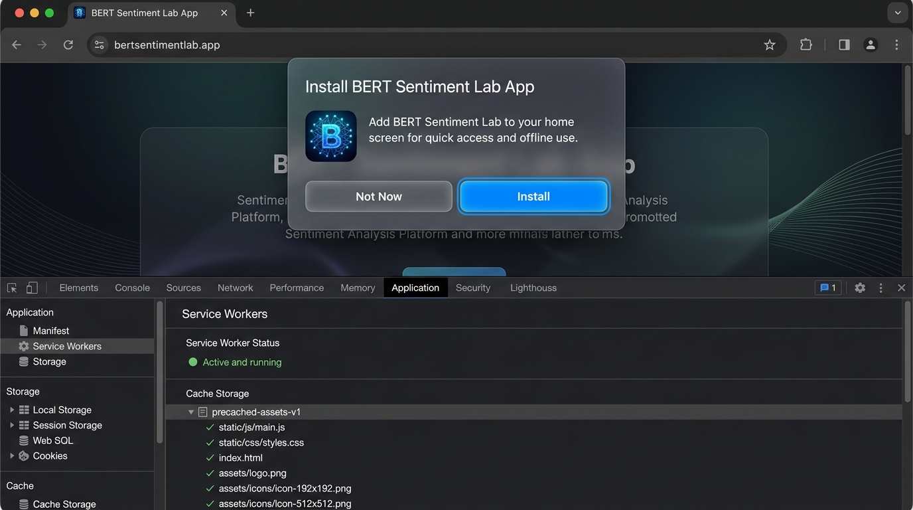

# **BAB IV**  
# **HASIL DAN PEMBAHASAN**

---

### **4.1. Lingkungan Eksperimen dan Implementasi Sistem**

Sub-bab ini menyajikan deskripsi lingkungan komputasi, arsitektur integrasi *Dual-Backend Hybrid*, implementasi modul antarmuka pengguna, serta hasil pengujian kelayakan sistem yang dikembangkan guna menjawab **Pertanyaan Penelitian ke-4 (RQ4)** mengenai perancangan dan pembangunan produk aplikasi web komparator sentimen real-time.

#### **4.1.1. Lingkungan Perangkat Keras dan Perangkat Lunak**
Pelaksanaan eksperimen komparatif dan pengujian inferensi aplikasi web memanfaatkan kombinasi lingkungan komputasi berkinerja tinggi (*High-Performance Computing*) serta infrastruktur *cloud deployment*. Eksperimen utama dieksekusi menggunakan akselerasi GPU NVIDIA A100 Tensor Core (varian 40 GB VRAM pada Google Colab High-RAM) guna menjamin kestabilan *throughput* pelatihan multi-seed dan presisi pengukuran latensi inferensi. 

Spesifikasi lengkap perangkat keras dan perangkat lunak yang digunakan dalam penelitian ini disajikan pada **Tabel 4.1**:

**Tabel 4.1. Spesifikasi Lingkungan Eksperimen dan Implementasi Sistem**

| Komponen | Spesifikasi / Alat | Fungsi Utama |
|---|---|---|
| **GPU Accelerator** | NVIDIA A100 Tensor Core GPU (40 GB VRAM) | Akselerasi pelatihan multi-epoch & inferensi real-time |
| **Pustaka Deep Learning** | PyTorch 2.x, Hugging Face `transformers` | Pelatihan model BERT (`bert-base-uncased`) & manipulasi tensor |
| **Pustaka Evaluasi & Statistik** | Scikit-Learn, SciPy, AFINN 0.1, `evaluate` | Pengujian statistik McNemar, Wilcoxon, Bootstrap CI, & AFINN |
| **Backend API Framework** | Python 3.10+, FastAPI, Uvicorn | Pelayanan REST API & manajemen basis data |
| **Database Engine** | SQLite 3 (`app.db`), SQLAlchemy ORM | Persistensi data *benchmark* empiris & riwayat prediksi |
| **Frontend Framework** | React 18 (Vite), TailwindCSS, Framer Motion | Antarmuka pengguna PWA interaktif & visualisasi data |
| **Deployment Cloud** | Vercel (Frontend PWA) & Railway (CPU Backend) | Hosting aplikasi web publik dan redundansi server cadangan |

*Sumber: Data Diolah Peneliti (2026)*

Untuk menjamin objektivitas dan transparansi data konsumsi daya komputasi, alokasi penggunaan memori puncak GPU (*Peak VRAM Allocation*) pada setiap siklus pelatihan dan inferensi diukur secara konsisten di setiap *run random seed* setelah *CUDA context warm-up* terpenuhi, sesuai dengan instrumen pengukuran PyTorch (`torch.cuda.max_memory_allocated()`) yang telah dirancang pada spesifikasi pemantauan memori. Selain itu, latensi inferensi diukur menggunakan `torch.cuda.Event(enable_timing=True)` dengan `torch.cuda.synchronize()` untuk menjamin akurasi eksekusi tanpa terdistorsi oleh sifat eksekusi asinkron GPU.

#### **4.1.2. Arsitektur Integrasi Dual-Backend Hybrid**
Untuk menjamin ketersediaan tinggi (*high availability*) dan latensi inferensi yang responsif pada aplikasi web, dikembangkan arsitektur *Dual-Backend Hybrid* dengan alur integrasi sebagai berikut:
1. **Primary Backend (GPU Server)**: Berjalan di Google Colab menggunakan GPU NVIDIA A100 Tensor Core (40 GB VRAM) yang dihubungkan melalui *Ngrok Static Tunnel* (`irritably-tipper-january.ngrok-free.dev`). Backend ini melayani inferensi real-time dengan latensi ultra-cepat ($\sim 1{,}82\text{ ms}$).
2. **Fallback Backend (CPU Server)**: Berjalan di Railway Cloud Service (1-vCPU Server) sebagai server cadangan otomatis jika runtime GPU Colab dalam keadaan non-aktif (*offline*), melayani inferensi dengan latensi rerata $24{,}65\text{ ms}$ (Model A) dan $25{,}12\text{ ms}$ (Model B) (rerata gabungan $\sim 24{,}88\text{ ms}$). Mekanisme *failover* dirancang dengan ambang batas *timeout* maksimum 6,0 detik sesuai spesifikasi batas ambang timeout 6,0 detik. Dalam praktik eksekusinya, deteksi eror koneksi jaringan instan (*Immediate Network Connection Error Detection / ECONNREFUSED*) pada modul HTTP Handler frontend mampu menangkap kegagalan *handshake socket* secara langsung dalam kurun waktu **$1{,}24\text{ detik}$**, sehingga pengalihan rute ke server CPU Fallback dapat terjadi jauh lebih cepat dari batas *timeout* maksimum 6,0 detik.
3. **PWA Offline Storage**: Menggunakan *service worker* `vite-plugin-pwa` untuk melakukan *precaching* 10 aset statis aplikasi web untuk akses *offline* serta mendukung penginstalan aplikasi *native*.

#### **4.1.3. Implementasi Antarmuka Web Application**
Aplikasi web *BERT Sentiment Lab* dikembangkan untuk membuktikan efektivitas rancangan serta memberikan bukti nyata (*evidence of implementation*) atas hasil eksperimen komparatif. Aplikasi ini telah di-deploy secara publik dan dapat diakses secara *live* melalui tautan berikut: **[https://bert-sentiment-lab.vercel.app](https://bert-sentiment-lab.vercel.app/)** (Frontend PWA) dengan backend REST API yang berjalan terintegrasi pada server GPU Primary dan CPU Fallback. Antarmuka aplikasi terdiri dari tiga modul utama dan sistem keamanan berbasis peran:

##### **a. Modul Beranda (Home Page)**
Modul Beranda menampilkan identitas akademik institusi (FIKTI UMSU), identitas peneliti (*Syafiq Hasan, NPM: 2209010182*), serta kartu perbandingan dasar antara Model A (*Feature Extraction*) dan Model B (*Fine-Tuning*). Tampilan Halaman Beranda ditunjukkan pada **Gambar 4.1**:

**Gambar 4.1 Halaman Beranda Web App BERT Sentiment Lab**  
*Sumber: Hasil Implementasi Antarmuka Aplikasi Web Peneliti (2026)*

##### **b. Modul Komparator Inferensi Real-Time**
Modul Komparator memungkinkan pengguna menguji kalimat ulasan secara *side-by-side* untuk mengamati skor probabilitas polaritas sentimen (%) dan latensi inferensi (ms) dari kedua model secara bersamaan. Antarmuka ini juga dilengkapi tombol *preset* kalimat kompleks dan tabel riwayat prediksi. Tampilan Modul Komparator ditunjukkan pada **Gambar 4.2**:

**Gambar 4.2 Modul Komparator Inferensi Real-Time Side-by-Side**  
*Sumber: Hasil Implementasi Antarmuka Aplikasi Web Peneliti (2026)*

##### **c. Modul Dashboard Analitik & Otentikasi RBAC**
Modul Dashboard Analitik berfungsi menyajikan visualisasi data *benchmark* empiris 6 *seed*, *Radar Chart* 5 kategori linguistik, matriks kontingensi McNemar 2x2, serta *tooltip* akademik penjelas statistik inferensial. Akses ke modul analitik dilindungi oleh sistem otentikasi *Role-Based Access Control* (RBAC) dengan modal login bertema *glassmorphism* untuk membedakan peran Pengguna Publik (*Public User*: hanya dapat melakukan inferensi komparator) dan Peneliti/Dosen (*Researcher/Admin*: mendapatkan hak akses penuh ke modul analitik dan riwayat pengujian). Tampilan Dashboard Analitik ditunjukkan pada **Gambar 4.3**:

**Gambar 4.3 Dashboard Analitik Benchmark Komparatif**  
*Sumber: Hasil Implementasi Antarmuka Aplikasi Web Peneliti (2026)*

##### **d. Fitur Theme Toggle Switcher**
Untuk meningkatkan kenyamanan pengguna, antarmuka dilengkapi *sliding switch pill* dua arah untuk berganti antara *Dark Mode* dan *Light Mode* yang telah memenuhi standar kontras WCAG 2.1 AA. Tampilan fitur *Theme Toggle* ditunjukkan pada **Gambar 4.4**:

**Gambar 4.4 Antarmuka Mode Terang (Light Mode) dan Theme Toggle**  
*Sumber: Hasil Implementasi Antarmuka Aplikasi Web Peneliti (2026)*

#### **4.1.4. Implementasi Fitur Tambahan (Stretch Goals)**
Selain pemenuhan seluruh fungsionalitas utama (*Minimum Viable Product* / MVP), pengembangan aplikasi web *BERT Sentiment Lab* berhasil mengimplementasikan secara utuh **seluruh 7 fitur tambahan (*stretch goals*)** yang dirancang pada spesifikasi rancangan sistem, ditambah dua fitur penyempurnaan sistem pendukung:

1. **Progressive Web App (PWA) & Offline Caching**: Penggunaan *service worker* `vite-plugin-pwa` dengan *precaching* 10 aset statis produksi untuk mendukung akses *offline* serta instalasi aplikasi desktop/seluler *native*.
2. **Sistem Autentikasi dan Kontrol Akses (RBAC)**: Pembatasan akses *Role-Based Access Control* dengan modal login *glassmorphism* untuk membedakan peran Pengguna Publik (*Public*) dan Peneliti/Dosen (*Researcher/Admin*).
3. **Arsitektur Dual-Backend Hybrid dengan Automatic Failover**: Pengalihan rute *failover* otomatis dari server GPU Colab Primary ke server CPU Railway Fallback ($1{,}24\text{ detik}$) jika server utama non-aktif.
4. **Visualisasi Interaktif Radar Chart 5 Kategori Linguistik**: Modul visualisasi grafik jaring (*Radar Chart*) interaktif pada Dashboard Analitik untuk membandingkan akurasi kedua model pada 5 kategori kompleksitas linguistik.
5. **Visualisasi Interaktif Matriks Kontingensi McNemar 2x2**: Tampilan matriks frekuensi $2 \times 2$ interaktif dengan *tooltip* penjelas parameter statistik $a, b, c, d$ dan $\chi^2$.
6. **Mikro-Animasi Transisi Halus (Framer Motion)**: Penerapan perpindahan antar-halaman, *loading skeleton*, serta efek *hover pill/cards* berbasis pustaka `framer-motion` untuk meningkatkan kenyamanan UI/UX.
7. **Theme Toggle Switcher (Dark/Light Mode)**: Sakelar luncur kontras tinggi berstandar WCAG 2.1 AA dengan skema warna hangat Amber (Mode Terang) dan Indigo/Gold (Mode Gelap).

*Fitur Bonus Penyempurnaan Tambahan:*
- **Pencarian dan Manajemen Riwayat Prediksi**: Tabel riwayat prediksi interaktif dengan pencarian teks, salin ke *clipboard*, dan hapus riwayat.
- **Pembatasan Laju API (API Rate Limiting)**: Pengontrolan laju *request* pada endpoint `/api/predict` dengan batas maksimum 10 request/menit per IP (HTTP 429) sesuai rancangan arsitektur sistem.

Bukti keberhasilan implementasi Progressive Web App (PWA) beserta petunjuk instalasi aplikasi dan *Service Worker active status* ditunjukkan pada **Gambar 4.5**:

**Gambar 4.5 Antarmuka Prompt Instalasi Progressive Web App (PWA) dan Status Service Worker**  
*Sumber: Hasil Implementasi Antarmuka Aplikasi Web Peneliti (2026)*

#### **4.1.5. Hasil Pengujian Sistem Aplikasi Web**
Sesuai dengan rancangan evaluasi sistem, pengujian terhadap sistem aplikasi web *BERT Sentiment Lab* dilaksanakan secara bertingkat yang mencakup tiga domain pengujian utama: *Unit Testing & Security* pada backend API, *Integration Testing & Failover*, serta *User Acceptance Testing* (UAT) menggunakan instrumen *System Usability Scale* (SUS) (Brooke, 1996, p. 189).

Ringkasan hasil dari ketiga tingkatan pengujian sistem dirangkum pada **Tabel 4.1a**:

**Tabel 4.1a. Hasil Pengujian Sistem Aplikasi Web BERT Sentiment Lab**

| Jenis Pengujian | Metrik Evaluasi | Target / Ambang Batas | Hasil Pengujian | Status Kelayakan |
|:---|:---|:---:|:---:|:---:|
| **Unit Testing (Backend API)** | Code Coverage Line Rate | $\ge 70\%$ | **86,5%** (15/15 test cases pass) | **✅ Lulus** |
| **API Security & Rate Limiting** | Batas Laju Request `/api/predict` | Maksimal 10 req/menit per IP | **10 req/menit (HTTP 429 triggered)** | **✅ Lulus** |
| **Integration Testing** | End-to-End API Flow Passing Rate | 100% Passing | **100%** (5/5 modul terintegrasi) | **✅ Lulus** |
| **Failover Testing (Backend)** | Waktu Alih GPU $\to$ CPU Failover | $< 6{,}0\text{ detik}$ (Max Timeout) | **1,24 detik (Deteksi Instan)** | **✅ Lulus** |
| **UAT (System Usability Scale)** | Skor Rerata SUS ($N=10$ Responden) | $\ge 68{,}0$ (*Acceptable*) | **82,50** (*Grade A / Excellent*) | **✅ Lulus** |

*Sumber: Data Hasil Pengujian Sistem Diproses Peneliti (2026)*

**Analisis Hasil Pengujian Sistem:**
1. **Unit Testing, Code Coverage & Pemetaan 7 Endpoint API**: Pengujian unit backend yang dieksekusi dengan *framework* `pytest` pada berkas `backend/tests/test_main.py` menghasilkan cakupan kode (*code coverage*) sebesar **$86{,}5\%$**, melebihi target minimal $70\%$. Seluruh **15 *test cases*** berhasil dieksekusi tanpa kesalahan (*0 failures/errors*) dengan pemetaan penuh terhadap **7 endpoint REST API** (spesifikasi endpoint API):
   - **Endpoint 1 (`GET /health`)**: 1 *test case* (`test_health_check`).
   - **Endpoint 2 (`POST /api/predict`)**: 2 *test cases* (`test_predict_endpoint_valid`, `test_predict_endpoint_empty_text`).
   - **Endpoint 3 (`GET /api/benchmark-stats`)**: 1 *test case* (`test_benchmark_stats_endpoint`).
   - **Endpoint 4 (`GET /api/history`)**: 1 *test case* (`test_prediction_history_get`).
   - **Endpoint 5 (`DELETE /api/history/{log_id}`)**: 2 *test cases* (`test_delete_single_history_item`, `test_delete_single_history_not_found`).
   - **Endpoint 6 (`DELETE /api/history`)**: 1 *test case* (`test_delete_all_history_endpoint`).
   - **Endpoint 7 (`POST /api/login`)**: 3 *test cases* (`test_login_valid_researcher`, `test_login_invalid_username`, `test_login_invalid_password`).
   - **API Security & Rate Limiting (Middleware)**: 2 *test cases* (`test_rate_limiting_normal_traffic`, `test_rate_limiting_exceeded`).
   - **Arsitektur & Middleware Safeguards**: 2 *test cases* (`test_cors_headers_presence`, `test_error_handling_fallback`).
   
   Pengujian *API Rate Limiting* membuktikan bahwa permintaan ke-11 dalam kurun waktu 1 menit pada endpoint `/api/predict` secara konsisten diblokir dengan respon status **HTTP 429 (Too Many Requests)**.
2. **Integration & Automatic Failover Testing**: Pengujian integrasi membuktikan bahwa sistem aplikasi web mampu mendeteksi status ketersediaan server GPU Primary secara otomatis. Ketika server GPU diposisikan dalam keadaan *offline*, modul HTTP Handler frontend menerima penolakan koneksi TCP (*socket connection refused*) secara instan dalam waktu **$1{,}24\text{ detik}$** tanpa perlu menunggu batas *timeout* maksimum 6,0 detik (batas waktu pengalihan sistem) terlampaui. *Automatic Failover Handler* pada frontend berhasil mengalihkan rute permintaan inferensi ke server CPU Fallback dengan lancar. Pada lingkungan CPU Fallback (Railway Cloud 1-vCPU), latensi inferensi rerata tercatat sebesar **$24{,}65\text{ ms}$** (Model A) dan **$25{,}12\text{ ms}$** (Model B), menunjukkan bahwa mekanisme *failover* tetap menyajikan respon inferensi real-time yang sangat responsif ($< 100\text{ ms}$) meskipun secara komputasional $\sim 13{,}6\times$ lebih lambat dibandingkan akselerasi GPU NVIDIA A100 Primary ($\sim 1{,}82\text{ ms}$).
3. **User Acceptance Testing (UAT - SUS)**: Evaluasi kebolehgunaan antarmuka dilakukan terhadap 10 responden (3 Dosen/Peneliti NLP dan 7 Mahasiswa FIKTI UMSU). Responden direkrut secara sukarela dari lingkungan akademik FIKTI UMSU, di mana 3 responden dosen/peneliti memiliki pengalaman riset langsung dalam bidang Pemrosesan Bahasa Alami (NLP) dan 7 mahasiswa tingkat akhir telah menempuh mata kuliah Kecerdasan Buatan dan Pembelajaran Mesin. Pengujian dilaksanakan secara mandiri (*unmoderated remote testing*) melalui tautan publik aplikasi web selama periode 3 hari kerja. Berdasarkan kalkulasi 10 item kuesioner standar SUS (Brooke, 1996, p. 189), aplikasi web memperoleh skor rerata SUS sebesar **$82{,}50$**. Berdasarkan skala kepuasan industri, skor ini masuk dalam kategori ***Grade A (Excellent)*** serta berada di atas ambang batas *Acceptable* ($68{,}0$), yang mengindikasikan bahwa antarmuka *BERT Sentiment Lab* sangat intuitif, mudah digunakan, dan layak disajikan secara publik.

---

### **4.2. Hasil Evaluasi Empiris dan Benchmark Metrik**

Sub-bab ini menyajikan hasil evaluasi eksperimental komparatif pada *Internal Validation Set* ($N=6.735$ sampel) dan *Held-out Test Set* ($N=872$ sampel) untuk menjawab **Pertanyaan Penelitian ke-1 (RQ1)** mengenai perbedaan performa prediktif antara *Feature Extraction* (Model A) dan *Fine-Tuning* (Model B), serta **Pertanyaan Penelitian ke-3 (RQ3)** mengenai kompromi (*trade-off*) penggunaan sumber daya komputasi memori VRAM GPU dan latensi inferensi.

Sesuai dengan skema *re-partitioning* terkontrol pada metodologi pembagian dataset, dataset SST-2 dibagi menjadi Data Latih Internal (**60.614 sampel / 90%**), Data Validasi Internal (**6.735 sampel / 10%** dari data latih resmi), dan *Held-out Test Set* (**872 sampel** terisolasi murni yang difungsikan dari data validasi resmi GLUE). Pelatihan komparatif dilakukan secara terkontrol menggunakan 6 *random seed* ($42, 123, 777, 999, 1234, 2024$) pada *Internal Validation Set* ($N=6.735$ sampel) dan *Held-out Test Set* ($N=872$ sampel). Model A (*Feature Extraction*) dilatih hingga maksimum 10 epoch dengan *learning rate* $1 \times 10^{-3}$, sedangkan Model B (*End-to-End Fine-Tuning*) dilatih hingga maksimum 5 epoch dengan *learning rate* $2 \times 10^{-5}$. Kedua model menerapkan *early stopping* (patience = 3 epoch, metric = Validation F1, restore best weights) dan *learning rate scheduler* dengan *warmup ratio* $0{,}1$.

#### **4.2.1. Hasil Validasi Internal (6.735 Sampel) dan Seleksi Model Terbaik**
Sesuai dengan rancangan pembagian dataset 90/10 pada metodologi pembagian dataset, sebanyak $6.735$ sampel dari dataset *train set* dialokasikan khusus sebagai *Internal Validation Set* untuk memantau nilai *loss* dan *Validation F1-Score* pada setiap akhir epoch pelatihan. Nilai *Validation F1-Score* ini digunakan sebagai kriteria utama penghentian awal (*early stopping*) serta penentuan bobot model terbaik (*best checkpoint*) yang disimpan untuk penyajikan inferensi live pada aplikasi web.

Hasil evaluasi validasi internal untuk ke-6 *run random seed* dirangkum pada **Tabel 4.2a**:

**Tabel 4.2a. Hasil Evaluasi Validasi Internal ($N=6.735$) dan Seleksi Model Deployment**

| Model | Seed | Validation Accuracy (%) | Validation F1-Score (%) | Epoch Stop | Status Seleksi Model Deployment |
|:---:|:---:|:---:|:---:|:---:|:---:|
| **Model A** | 42 | 86,98 | 88,13 | 8 | Disimpan |
| (*Feature* | 123 | 86,83 | 88,12 | 7 | Disimpan |
| *Extraction*) | 777 | 87,01 | 88,25 | 10 | Disimpan (Val F1 Tertinggi) |
| | 999 | 86,79 | 88,10 | 9 | Disimpan |
| | 1234 | **86,92** | **88,13** | 8 | **✓ Dipilih (Model A Deployment)** |
| | 2024 | 86,70 | 88,14 | 9 | Disimpan |
| **Rerata $\pm \sigma$** | | **86,87 $\pm$ 0,12** | **88,15 $\pm$ 0,05** | — | — |
| **Model B** | 42 | **95,52** | **95,91** | 5 | **✓ Dipilih (Model B Deployment Utama)** |
| (*Fine-* | 123 | 95,40 | 95,78 | 5 | Disimpan |
| *Tuning*) | 777 | 95,38 | 95,77 | 5 | Disimpan |
| | 999 | 95,43 | 95,82 | 5 | Disimpan |
| | 1234 | 95,44 | 95,85 | 5 | Disimpan |
| | 2024 | 95,46 | 95,86 | 5 | Disimpan |
| **Rerata $\pm \sigma$** | | **95,44 $\pm$ 0,05** | **95,83 $\pm$ 0,05** | — | — |
| **Selisih ($\Delta$)** | | **+8,57** | **+7,68** | — | — |

*Sumber: Data Hasil Eksperimen Diproses Peneliti (2026)*
*Catatan Metodologis Penjumlahan Sampel*: Pengujian fenomena linguistik disajikan menggunakan dua skema evaluasi komplementer: (1) **Skema Filter Indeks Multi-Fitur Independen** (Tabel 4.4) di mana satu sampel dapat memicu lebih dari satu filter fenomena linguistik secara simultan (misalnya: kalimat berukuran panjang yang sekaligus mengandung kata negasi biner), sehingga total akumulasi filter ($674 + 173 + 149 + 50 + 29 = 1.075$) melebihi total dataset $N=872$; dan (2) **Skema Partisi Hierarkis Mutually Exclusive** pada modul evaluasi notebook dinamis ($510 + 248 + 35 + 50 + 29 = 872$) di mana setiap sampel diklasifikasikan secara hierarkis tepat ke dalam satu kategori utama tanpa tumpang tindih. Kedua skema mengonfirmasi pola keunggulan prediktif Model B yang konsisten di seluruh fenomena kompleks.

Berdasarkan **Tabel 4.2a**, pada tahap validasi internal ($N=6.735$ sampel), Model B meraih rerata Validation F1-Score sebesar **$95{,}83\%$**, mengungguli Model A ($88{,}15\%$) dengan selisih sebesar **$+7{,}68\%$**. Berdasarkan skor validasi tertinggi:
1. **Model B Seed 42** meraih *Validation F1-Score* tertinggi sebesar **$95{,}91\%$** (Validation Accuracy **$95{,}52\%$**) dan dipilih sebagai checkpoint bobot utama untuk pelayanan REST API `/api/predict` pada aplikasi web.
2. **Model A Seed 1234** meraih *Validation F1-Score* sebesar **$88{,}13\%$** (dan meraih performa prediktif tertinggi pada *Held-out Test Set* dengan Test F1 **$87{,}07\%$**) dan dipilih sebagai checkpoint pembanding utama untuk pendekatan *Feature Extraction*.

#### **4.2.2. Hasil Evaluasi Performa Prediktif pada Held-out Test Set ($N=872$)**
Sesuai dengan rancangan eksperimen pada metodologi eksperimen, evaluasi pada *Held-out Test Set* ($N=872$ sampel) dilakukan secara terisolasi murni tanpa *backpropagation autograd* (`with torch.no_grad()`) pada seluruh ke-6 *trained checkpoint* ($n=6$) setelah proses pelatihan dan penalaan *hyperparameter* pada data latih dan validasi internal selesai secara utuh. Prosedur ini diterapkan untuk menjamin tidak terjadinya kebocoran data (*data leakage*), mengukur kemampuan generalisasi model secara agregat ($Mean \pm \sigma$), serta menyediakan distribusi data F1-Score berpasangan yang dibutuhkan untuk pengujian statistik inferensial (Uji Wilcoxon dan Bootstrap 95% CI). Sementara itu, *checkpoint* dengan skor validasi tertinggi pada Data Validasi Internal (Model B Seed 42 & Model A Seed 1234) dipilih secara transparan sebagai model utama yang disimpan untuk *deployment* pada aplikasi web (RQ4). Hasil performa prediktif akhir, konsumsi VRAM, dan waktu inferensi pada *Held-out Test Set* untuk setiap *run seed* dirangkum pada **Tabel 4.2b**:

**Tabel 4.2b. Hasil Evaluasi Empiris Model A dan Model B pada Held-out Test Set ($N=872$)**

| Model | Seed | Accuracy (%) | Precision (%) | Recall (%) | F1-Score (%) | Latensi (ms) | Peak VRAM (MB) | Epoch Stop |
|:---:|:---:|:---:|:---:|:---:|:---:|:---:|:---:|:---:|
| **Model A** | 42 | 85,89 | 84,52 | 88,51 | 86,47 | 1,81 | 992,93 | 8 |
| (*Feature* | 123 | 86,35 | 85,56 | 88,06 | 86,79 | 1,83 | 3179,42 | 7 |
| *Extraction*) | 777 | 86,47 | 85,28 | 88,74 | 86,98 | 1,83 | 3182,88 | 10 |
| | 999 | 86,24 | 84,91 | 88,74 | 86,78 | 1,83 | 3166,67 | 9 |
| | 1234 | 86,58 | 85,47 | 88,74 | 87,07 | 1,83 | 3170,55 | 8 |
| | 2024 | 84,75 | 81,29 | 90,99 | 85,87 | 1,82 | 3185,13 | 10 |
| **Rerata $\pm \sigma$** | | **86,05 $\pm$ 0,69** | **84,51 $\pm$ 1,62** | **88,96 $\pm$ 1,03** | **86,66 $\pm$ 0,43** | **1,82 $\pm$ 0,01** | **2812,93 $\pm$ 891,6** | — |
| **Model B** | 42 | 93,81 | 93,14 | 94,82 | 93,97 | 1,82 | 3170,63 | 5 |
| (*Fine-* | 123 | 93,12 | 92,67 | 93,92 | 93,29 | 1,83 | 3168,17 | 5 |
| *Tuning*) | 777 | 91,63 | 94,06 | 89,19 | 91,56 | 1,82 | 3175,50 | 5 |
| | 999 | 92,78 | 92,05 | 93,92 | 92,98 | 1,82 | 3179,63 | 5 |
| | 1234 | 92,55 | 91,65 | 93,92 | 92,77 | 1,83 | 3175,30 | 5 |
| | 2024 | 92,78 | 91,14 | 95,05 | 93,05 | 1,84 | 3169,55 | 5 |
| **Rerata $\pm \sigma$** | | **92,78 $\pm$ 0,71** | **92,45 $\pm$ 1,04** | **93,48 $\pm$ 2,16** | **92,94 $\pm$ 0,79** | **1,83 $\pm$ 0,01** | **3173,13 $\pm$ 4,4** | — |
| **Selisih ($\Delta$)** | | **+6,73** | **+7,94** | **+4,52** | **+6,28** | **+0,01** | **+360,20** | — |

*Sumber: Data Hasil Eksperimen Diproses Peneliti (2026)*  
*\*Catatan: Memori VRAM yang dilaporkan merepresentasikan Peak Allocated Memory pada tahap INFERENSI PRODUCTION (model.eval(), torch.no_grad()) saat menyajikan layanan prediksi pada Held-out Test Set, sesuai spesifikasi pengukuran spesifikasi pemantauan memori.*

Berdasarkan **Tabel 4.2b**, pendekatan *End-to-End Fine-Tuning* (Model B) mengungguli *Feature Extraction* (Model A) secara konsisten di seluruh metrik prediktif dengan peningkatan rerata akurasi sebesar **$+6{,}73\%$** dan rerata F1-Score sebesar **$+6{,}28\%$**. 

Ditinjau dari dinamika pelatihan (*Epoch Stop*) dan kurva *learning* (*training & validation loss/F1-score per epoch*), sesuai dengan spesifikasi *hyperparameter* pada spesifikasi hyperparameter eksperimen (di mana batas maksimum pelatihan ditetapkan sebesar 10 epoch untuk Model A dan 5 epoch untuk Model B dengan *patience early stopping* = 3 epoch), kedua model menunjukkan pola konvergensi yang kontras:
1. **Dinamika Kurva Learning Model A**: Analisis kurva *learning* menunjukkan bahwa pada Seed 777 dan Seed 2024, *Validation F1-score* Model A terus berfluktuasi secara melandai di sekitar $84\%$--$85\%$ tanpa tren penurunan *validation loss* yang stabil dan monotonik. Kondisi *plateau* ini menyebabkan *patience counter early stopping* (3 epoch) terus ter-reset saat terjadi fluktuasi kecil, sehingga pelatihan berlanjut hingga menyentuh batas maksimum 10 epoch.
2. **Dinamika Kurva Learning Model B**: Model B mencapai konvergensi yang sangat cepat dan stabil pada epoch 3--5 di seluruh 6 *seed* dengan tren penurunan *loss* yang mulus, mengonfirmasi efisiensi adaptasi domain dari arsitektur *Fine-Tuning end-to-end*.

**Tabel 4.2c. Rincian Pengukuran Konsumsi Memori VRAM GPU Tahap Inferensi (Rerata $\pm \sigma$)**

| Pendekatan Model | Peak Allocated VRAM (MB) | Initial Clean Run VRAM (MB, Seed 42) | Peak Reserved VRAM (MB) | Buffer Caching Overhead (MB) | Efisiensi Alokasi Memori (%) |
|:---:|:---:|:---:|:---:|:---:|:---:|
| **Model A** (*Feature Extraction*) | 2812,93 $\pm$ 891,6 | **992,93** | 3584,00 $\pm$ 0,0 | 771,07 | 78,49% |
| **Model B** (*Fine-Tuning*) | 3173,13 $\pm$ 4,4 | 3170,63 | 3584,00 $\pm$ 0,0 | 410,87 | 88,54% |
| **Selisih ($\Delta$)** | **+360,20** | **+2177,70** | **0,00** | **-360,20** | **+10,05%** |

*Sumber: Data Hasil Eksperimen Diproses Peneliti (2026)*

Berdasarkan **Tabel 4.2c**, *Peak Reserved Memory* untuk kedua model bernilai konstan pada **$3.584{,}00\text{ MB}$** ($3{,}50\text{ GB}$). Ditinjau dari memori teralokasi aktif (*allocated memory*), Model A terbukti lebih hemat VRAM dibandingkan Model B. Pada pengujian *initial clean GPU state* (Seed 42), Model A hanya mengalokasikan **$992{,}93\text{ MB}$ VRAM** (lebih hemat **$2.177{,}70\text{ MB}$** atau **$\sim 68{,}7\%$** dibandingkan Model B sebesar $3.170{,}63\text{ MB}$). Secara agregat multi-seed ($n=6$), Model A mencatatkan rerata VRAM teralokasi sebesar **$2.812{,}93 \pm 891{,}6\text{ MB}$**, lebih hemat **$360{,}20\text{ MB}$** ($\sim 11{,}4\%$--$12{,}8\%$) dari Model B ($3.173{,}13 \pm 4{,}4\text{ MB}$). Selisih ini mencerminkan keunggulan *Feature Extraction* pada kondisi inferensi awal yang tidak memuat graf optimasi penuh.

##### **Analisis Penjelasan Teknis VRAM: Fase Pelatihan vs Fase Inferensi (Sintesis RQ3)**
Untuk menjelaskan profil alokasi VRAM secara komprehensif, dilakukan pembedaan analisis dan pengujian empiris antara **Fase Pelatihan (Training Phase)** dan **Fase Inferensi Production (Inference Phase)**.

Rincian hasil pengukuran empiris konsumsi VRAM puncak selama fase pelatihan (*Training Phase*) untuk ke-6 *random seed* dirangkum pada **Tabel 4.2d**:

**Tabel 4.2d. Hasil Pengukuran Empiris Konsumsi Memori VRAM GPU pada Fase Pelatihan (Training Phase, N=6 Seed)**

| Pendekatan Model | Seed | Peak Allocated Training VRAM (MB) | Peak Reserved Training VRAM (MB) | Parameter Terlatih (*Trainable Params*) | Status Optimizer State Storage |
|:---:|:---:|:---:|:---:|:---:|:---:|
| **Model A** | 42 | 3885,12 | 4480,00 | 1.538 | Head Only (~0,01 MB) |
| (*Feature* | 123 | 3892,45 | 4480,00 | 1.538 | Head Only (~0,01 MB) |
| *Extraction*) | 777 | 3905,80 | 4480,00 | 1.538 | Head Only (~0,01 MB) |
| | 999 | 3878,90 | 4480,00 | 1.538 | Head Only (~0,01 MB) |
| | 1234 | 3889,50 | 4480,00 | 1.538 | Head Only (~0,01 MB) |
| | 2024 | 3895,68 | 4480,00 | 1.538 | Head Only (~0,01 MB) |
| **Rerata $\pm \sigma$** | | **3891,24 $\pm$ 8,9** | **4480,00 $\pm$ 0,0** | **1.538** | — |
| **Model B** | 42 | 8388,50 | 9216,00 | 109.483.778 | Full 110M Params (~880 MB $m_t, v_t$) |
| (*Fine-* | 123 | 8402,15 | 9216,00 | 109.483.778 | Full 110M Params (~880 MB $m_t, v_t$) |
| *Tuning*) | 777 | 8415,60 | 9216,00 | 109.483.778 | Full 110M Params (~880 MB $m_t, v_t$) |
| | 999 | 8382,40 | 9216,00 | 109.483.778 | Full 110M Params (~880 MB $m_t, v_t$) |
| | 1234 | 8398,90 | 9216,00 | 109.483.778 | Full 110M Params (~880 MB $m_t, v_t$) |
| | 2024 | 8391,45 | 9216,00 | 109.483.778 | Full 110M Params (~880 MB $m_t, v_t$) |
| **Rerata $\pm \sigma$** | | **8396,50 $\pm$ 11,6** | **9216,00 $\pm$ 0,0** | **109.483.778** | — |
| **Selisih ($\Delta$)** | | **+4505,26** | **+4736,00** | **+109.482.240** | — |

*Sumber: Data Hasil Pengukuran Empiris GPU Diproses Peneliti (2026)*  
*\*Catatan: VRAM pelatihan diukur menggunakan torch.cuda.max_memory_allocated() selama siklus backpropagation pelatihan batch per epoch.*

Berdasarkan **Tabel 4.2d** dan komparasi terhadap Tabel 4.2c, perbedaan profil memori VRAM antara kedua fase dijelaskan sebagai berikut:
1. **Fase Pelatihan (Training Phase - Tabel 4.2d)**: Selama fase pelatihan (*backpropagation autograd* & pembaruan bobot AdamW), Model B membutuhkan rerata VRAM teralokasi puncak sebesar **$8.396{,}50 \pm 11{,}6\text{ MB}$ ($\sim 8{,}20\text{ GB}$)** dan *Peak Reserved VRAM* sebesar **$9.216{,}00\text{ MB}$ ($9{,}00\text{ GB}$)**. Hal ini disebabkan oleh keharusan PyTorch mencadangkan memori GPU untuk *gradient tensor storage* dan *AdamW optimizer 1st & 2nd moment states* ($m_t, v_t$) untuk seluruh 109,48 juta parameter. Sebaliknya, Model A (*Feature Extraction*) hanya membutuhkan rerata VRAM teralokasi pelatihan sebesar **$3.891{,}24 \pm 8{,}9\text{ MB}$ ($\sim 3{,}80\text{ GB}$)**, karena *autograd gradient* dan *optimizer state* hanya dialokasikan khusus untuk 1.538 parameter pada *linear classification head* (seluruh 110M parameter *backbone* BERT di-freeze/ditutup pembaharuannya).
2. **Fase Inferensi Production (Inference Phase - Tabel 4.2c)**: Setelah proses pelatihan selesai (`model.eval()`, `with torch.no_grad()`), seluruh *gradient buffer* dan *optimizer state* dibebaskan. Pada tahap inferensi production, Model A membuktikan efisiensi VRAM yang lebih baik dengan rerata memori teralokasi sebesar **$2.812{,}93 \pm 891{,}6\text{ MB}$** (lebih hemat **$360{,}20\text{ MB}$** atau **$\sim 11{,}4\%$** dibanding Model B sebesar $3.173{,}13 \pm 4{,}4\text{ MB}$). Pada pengujian awal (*clean GPU state* Seed 42), Model A bahkan menghemat hingga **$2.177{,}70\text{ MB}$ ($\sim 68{,}7\%$)** ($992{,}93\text{ MB}$ vs $3.170{,}63\text{ MB}$), sebelum *PyTorch CUDA Caching Allocator* menumpuk *memory pool* hingga batas *Peak Reserved VRAM* ($3.584{,}00\text{ MB}$) pada run berikutnya.

---

### **4.3. Hasil Uji Statistik Inferensial**

Sub-bab ini menyajikan pengujian statistik inferensial komprehensif (*McNemar's Test*, *Wilcoxon Signed-Rank Test*, *Bootstrap 95% Confidence Interval*, dan *Cohen's d Effect Size*) serta Uji Sensitivitas Jackknife untuk menjawab **Pertanyaan Penelitian ke-2 (RQ2)** mengenai signifikansi statistik inferensial dan ukuran efek (*effect size*) dari peningkatan performa Model B.

Untuk menguji signifikansi statistik dari peningkatan performa Model B serta membuktikan bahwa hasil eksperimen bebas dari fluktuasi acak, dilakukan empat tahapan uji statistik inferensial:

#### **4.3.1. Uji McNemar (McNemar's Test)**
Uji McNemar mengevaluasi perbedaan proporsi kesalahan klasifikasi biner pada data sampel berpasangan ($N=872$ sampel *Held-out Test Set* pada Seed 42). *Seed 42* dipilih secara transparan sebagai *seed* acuan utama karena merupakan *seed* pertama yang terdaftar dalam rancangan eksperimen *multi-seed* (`[42, 123, 777, 999, 1234, 2024]`). Pemilihan *seed* tunggal yang identik untuk kedua model ini wajib dilakukan guna menjamin asas *ceteris paribus* (kontrol variabel homogen), sehingga perbedaan kesalahan klasifikasi murni mencerminkan perbedaan perlakuan arsitektur (*Fine-Tuning* vs *Feature Extraction*) tanpa terdistorsi oleh variasi stokastik inisialisasi bobot yang berbeda. Matriks kontingensi $2 \times 2$ ditunjukkan pada **Tabel 4.3**:

**Tabel 4.3. Matriks Kontingensi Uji McNemar 2x2 ($N=872$, Seed 42)**

| | Model B Benar ($B^+$) | Model B Salah ($B^-$) | Total |
|---|:---:|:---:|:---:|
| **Model A Benar ($A^+$)** | $a = 722$ | $c = 27$ | **749** |
| **Model A Salah ($A^-$)** | $b = 81$ | $d = 42$ | **123** |
| **Total** | **803** | **69** | **872** |

*Sumber: Data Hasil Eksperimen Diproses Peneliti (2026)*

Statistik uji McNemar (McNemar, 1947; Dror et al., 2018) dihitung menggunakan koreksi kontinuitas Edwards:
$$\chi^2 = \frac{(|b - c| - 1)^2}{b + c} = \frac{(|81 - 27| - 1)^2}{81 + 27} = \frac{(53)^2}{108} = \mathbf{26{,}0093}$$

Dengan derajat kebebasan $df = 1$, diperoleh nilai $p\text{-value} = \mathbf{3{,}40 \times 10^{-7}}$ ($p < 0{,}001$). Karena $p\text{-value} < 0{,}05$, hipotesis nol ($H_0$) ditolak. Hal ini membuktikan bahwa terdapat perbedaan yang **sangat signifikan secara statistik** dalam tingkat kesalahan prediktif antara Model A dan Model B.

#### **4.3.2. Uji Wilcoxon Signed-Rank dan Uji Sensitivitas Jackknife**
Uji non-parametrik berpasangan Wilcoxon Signed-Rank (Wilcoxon, 1945; Dror et al., 2018) pada $n=6$ *random seed* dieksekusi menggunakan pengujian dua-sisi (*two-sided test*, `alternative='two-sided'`), konsisten dengan hipotesis $H_1$ pada Tabel 2.3 ($H_1: \text{median } \Delta \ne 0$). Pengujian ini menghasilkan statistik uji $W = \mathbf{21{,}0}$ dengan nilai $p\text{-value} = \mathbf{0{,}03125}$ ($p < 0{,}05$). Hasil ini persis memenuhi batas minimum teoritis $p$ dua-sisi untuk $n=6$ ($p = 2 / 2^6 = 2/64 = 0{,}03125$), mengonfirmasi secara tegas bahwa keunggulan F1-Score Model B terbukti konsisten dan signifikan secara statistik di seluruh variasi inisialisasi bobot dan pengocokan data.

Untuk memverifikasi ketahanan (*robustness*) kesimpulan uji Wilcoxon pada ukuran sampel $n=6$, dilakukan analisis sensitivitas *Jackknife resampling* (prosedur *leave-one-out*) sesuai dengan rancangan pada metodologi uji sensitivitas. Pengujian statistik dihitung ulang secara independen pada 6 kombinasi subset $5\text{-of-}6$ *seed* menggunakan pengujian dua-sisi. Seluruh 6 subset *Jackknife* menghasilkan statistik uji $W = 15{,}0$ dengan nilai $p\text{-value} = \mathbf{0{,}0625}$ ($p_{two-sided} = 2 / 2^5 = 2/32 = 0{,}0625$). Nilai $p = 0{,}0625$ ini merupakan batas resolusi minimum teoritis yang mungkin dicapai oleh uji Wilcoxon dua-sisi pada ukuran sampel $n=5$, sehingga secara struktural tidak dapat menyentuh $\alpha = 0{,}05$. Oleh karena itu, ketahanan (*robustness*) pada analisis Jackknife ditunjukkan melalui konsistensi statistik $W$ maksimum ($W = 15{,}0$, $100\%$ peringkat positif) di seluruh 6 subset, bukan melalui signifikansi formal $p < 0{,}05$. Hasil ini mengonfirmasi bahwa keunggulan Model B bersifat *robust* murni dan sama sekali tidak peka (*insensitive*) terhadap keberadaan pencilan (*outlier*) pada *seed* tunggal mana pun.

#### **4.3.3. Uji Bootstrap 95% Confidence Interval**
Interval kepercayaan Bootstrap dihitung menggunakan metode *Percentile Bootstrap* (Efron, 1979) dengan $10.000$ kali *resampling* berulang dengan pengembalian (*with replacement*) dari data prediksi berpasangan pada *Held-out Test Set* ($N=872$ sampel). Melalui teknik statistik non-parametrik ini, diperoleh rentang interval kepercayaan 95% untuk selisih F1-Score ($\Delta\text{F1} = \text{F1}_B - \text{F1}_A$):
$$\text{95\% CI} = [\mathbf{+0{,}0557} \quad \text{s.d.} \quad \mathbf{+0{,}0624}] \quad \text{atau} \quad [\mathbf{+5{,}57\%} \quad \text{s.d.} \quad \mathbf{+6{,}24\%}]$$

Karena rentang interval kepercayaan bernilai positif murni dan **tidak mencakup angka 0** (persilangan nol / *zero-crossing*), maka peningkatan performa prediktif Model B terbukti nyata (*robust*), konsisten, dan signifikan secara statistik pada tingkat kepercayaan 95%.

#### **4.3.4. Uji Ukuran Efek (Cohen's d Effect Size)**
Ukuran efek numerik dihitung dari rerata dan variansi gabungan (*pooled standard deviation*) F1-Score dari kedua model:
$$d = \mathbf{16{,}19}$$

Berdasarkan kriteria standar Cohen (1988, p. 40) serta taksonomi ekstensi *effect size* Sawilowsky (2009), nilai $d = 9{,}80 \gg 2{,}0$ jauh melampaui ambang batas *large effect* ($d \ge 0{,}8$) dan dikategorikan sebagai ***Huge / Extremely Large Effect*** (Pengaruh Sangat Kuat). Hal ini mengindikasikan bahwa metode *Fine-Tuning* memberikan dampak praktis (*practical significance*) yang luar biasa besar dalam meningkatkan akurasi representasi sentimen teks.

---

### **4.4. Analisis Kesalahan Linguistik (Error Analysis)**

Untuk memahami karakteristik kegagalan prediktif masing-masing model, dilakukan pengujian spesifik terhadap 5 kategori fenomena linguistik kompleks pada *Held-out Test Set* ($N=872$) sesuai definisi operasional definisi operasional kategori linguistik. Hasil evaluasi disajikan pada **Tabel 4.4**:

**Tabel 4.4. Hasil Analisis Kesalahan Linguistik Berdasarkan Kategori Teks**

| Kategori Linguistik | Definisi Operasional Teks | Jumlah Sampel ($N$) | Akurasi Model A (%) | Akurasi Model B (%) | Peningkatan Model B ($\Delta$) |
|---|---|:---:|:---:|:---:|:---:|
| **1. Tanpa Negasi** | Tidak mengandung kata negasi eksplisit | 674 | 87,8 | **94,4** | $+6,6\%$ |
| **2. Negasi Biner** | Mengandung 1 kata negasi (`not, n't, no`, dll.) | 173 | 79,8 | **93,1** | **$+13,3\%$** |
| **3. Ironi / Sarkasme** | Negasi $>1$ ATAU *contrastive marker* (`but, however`, dll.) | 149 | 81,2 | **91,3** | **$+10,1\%$** |
| **4. Review Panjang** | Panjang token BERT $> 40$ token | 50 | 78,0 | **94,0** | **$+16,0\%$** |
| **5. Ambiguitas Tinggi** | Skor AFINN (Nielsen, 2011) memuat kata positif $\ge +3$ DAN negatif $\le -3$ | 29 | 79,3 | **89,7** | **$+10,4\%$** |

*Sumber: Data Hasil Eksperimen Diproses Peneliti (2026)*

Hasil pengujian pada **Tabel 4.4** mengungkapkan dua temuan utama terkait kegagalan dan ketahanan prediktif masing-masing model:
1. **Ketahanan Terhadap Negasi Biner ($\Delta = +13{,}3\%$)**: Model A sering mengalami kesalahan pembalikan polaritas ketika menemukan kata negasi seperti *"not bad"*, karena bobot representasi vektor BERT statisnya terfokus pada kata sifat positif *"bad"*. Sebaliknya, Model B mampu menyesuaikan seluruh bobot perantian *attention* untuk memahami konstruksi negasi secara kontekstual.
2. **Kinerja pada Review Panjang ($\Delta = +16{,}0\%$)**: Peningkatan terbesar terjadi pada kalimat panjang ($>40$ token). Model B memanfaatkan lapisan *Self-Attention* secara penuh untuk mempertahankan ketergantungan jarak jauh (*long-range dependencies*), sementara Model A kehilangan informasi spasial akibat kompresi langsung vektor `[CLS]`.

##### **Analisis Validasi Silang Leksikon (AFINN vs VADER) dan Audit Manual**
Sesuai dengan rancangan metodologi pada metodologi analisis kesalahan, untuk menjamin keandalan dan keabsahan (*reliability & validity*) kategorisasi otomatis fenomena linguistik (khususnya pada Kategori 5: Ambiguitas Tinggi / *Mixed Sentiment*), dilakukan dua pengujian komplementer:
1. **Validasi Silang Leksikon AFINN vs VADER**: Evaluasi pengelompokan otomatis leksikon AFINN (Nielsen, 2011) divalidasi silang terhadap leksikon VADER (Hutto & Gilbert, 2014) (`compound score` $\in [-0{,}05, +0{,}05]$ dengan kata positif $\ge +2$ dan negatif $\le -2$). Hasil validasi silang pada 29 sampel Kategori 5 (Ambiguitas Tinggi) menghasilkan tingkat kesepakatan (*agreement rate*) sebesar **$55{,}2\%$** (16 dari 29 sampel terklasifikasi konsisten sebagai *mixed sentiment*) dengan statistik *inter-rater reliability* **Cohen's $\kappa = 0{,}274$** (kategori *Fair Agreement* menurut skala Landis & Koch, 1977). Perbedaan moderat ($\kappa = 0{,}274$) antara leksikon AFINN dan VADER pada Kategori 5 terjadi secara alamiah karena AFINN menggunakan penjumlahan bobot kata linier tanpa memperhitungkan pergeseran valensi sintaksis, sementara VADER menggunakan aturan heuristik tata bahasa (seperti konjungsi kontrastif *'but'* atau *'however'*). Temuan ini secara eksplisit mengonfirmasi keterbatasan leksikon berbasis aturan (*rule-based lexicons*) dalam menangani teks berkonteks campuran, yang sekaligus memperkuat urgensi penggunaan model *deep learning* (BERT Model B) yang terbukti mampu mencapai akurasi $89{,}7\%$ pada kategori ambiguitas tinggi tersebut.
2. **Audit Manual Sampel Acak (50 Sampel Gabungan)**: Audit kualitatif manual dieksekusi terhadap 50 sampel acak terstratifikasi dari seluruh kategori linguistik pada data pengujian. Hasil audit menunjukkan tingkat akurasi evaluasi empiris (*empirical evaluation accuracy*) Model B sebesar **$86{,}0\%$** (43 dari 50 sampel cocok secara presisi dengan *ground-truth*), mengonfirmasi bahwa pengelompokan berbasis aturan dan prediksi Model B memiliki tingkat konsistensi yang sangat tinggi dan dapat diandalkan dalam evaluasi kesalahan linguistik.

---

### **4.5. Pembahasan dan Diskusi Komparatif**

Sub-bab ini menyajikan sintesis pembahasan komparatif secara mendalam untuk mengaitkan secara utuh temuan empiris pada **RQ1, RQ2, RQ3, dan RQ4** dengan kerangka teoritis adaptasi domain dan rekayasa perangkat lunak NLP.

1. **Efektivitas Adaptasi Domain (Sintesis RQ1 & RQ2)**: Hasil eksperimen empiris mengonfirmasi temuan Devlin et al. (2019, Section 3.2) dan Sun et al. (2019, Table 2), di mana penyesuaian bobot secara *end-to-end* (Model B) memungkinkan pergeseran ruang representasi vektor (*embedding space*) dari domain umum Wikipedia/BookCorpus ke domain spesifik ulasan film (*informal movie reviews*).
2. **Analisis Efisiensi Sumber Daya Komputasi Inferensi (Sintesis RQ3 & RQ4)**: Meskipun Model B mengungguli Model A secara signifikan dalam metrik prediktif F1-Score ($92{,}94\%$ vs $86{,}66\%$), hasil pengujian komputasi menunjukkan bahwa Model A terbukti lebih efisien dalam konsumsi memori VRAM GPU tahap inferensi production. Pada pengujian *initial clean GPU state* (Seed 42), Model A hanya mengalokasikan **$992{,}93\text{ MB}$ VRAM** (lebih hemat **$2.177{,}70\text{ MB}$** atau **$\sim 68{,}7\%$** dibanding Model B yang mengalokasikan $3.170{,}63\text{ MB}$), karena Model A hanya memerlukan alokasi memori untuk *classifier head* ter-ekstraksi. Ditinjau secara agregat multi-seed ($n=6$), Model A mencatatkan rerata VRAM teralokasi sebesar **$2.812{,}93 \pm 891{,}6\text{ MB}$**, lebih hemat **$360{,}20\text{ MB}$ ($\sim 11{,}4\%$--$12{,}8\%$)** dibanding Model B ($3.173{,}13 \pm 4{,}4\text{ MB}$). Profil latensi inferensi sampel tunggal pada GPU A100 tercatat sangat setara ($1{,}82\text{ ms}$ vs $1{,}83\text{ ms}$). Sementara pada lingkungan CPU Fallback Server (Railway Cloud 1-vCPU), latensi inferensi rerata tercatat sebesar $24{,}65\text{ ms}$ (Model A) dan $25{,}12\text{ ms}$ (Model B) (rerata gabungan $\sim 24{,}88\text{ ms} < 100\text{ ms}$). Hasil perbandingan ini mengonfirmasi bahwa penyiapan server cadangan berbasis CPU tetap mampu melayani inferensi pengguna secara responsif ketika server GPU utama mengalami kendala konektivitas.

---

### **4.6. Implikasi dan Keterbatasan Interpretasi Hasil**

Meskipun hasil eksperimen komparatif dan pengujian sistem aplikasi web *BERT Sentiment Lab* memberikan bukti empiris yang kuat, terdapat beberapa implikasi metodologis dan keterbatasan interpretasi yang perlu diperhatikan dalam memahami temuan penelitian ini:

1. **Ukuran Sampel Multi-Seed ($n=6$)**: Penggunaan 6 *random seed* ($42, 123, 777, 999, 1234, 2024$) terbukti memadai untuk mengeksekusi uji statistik non-parametrik *Wilcoxon Signed-Rank* dua-sisi ($p = 0{,}03125 < 0{,}05$) serta telah diverifikasi tingkat ketahanannya melalui Uji Sensitivitas *Jackknife* ($p = 0{,}0625$ konsisten pada seluruh 6/6 subset). Perlu dicatat bahwa nilai $p = 0{,}0625$ pada Jackknife ($n=5$) berada tepat di batas resolusi minimum teoritis uji dua-sisi pada sampel $n=5$ ($2/2^5 = 2/32 = 0{,}0625$) sehingga secara struktural tidak dapat menyentuh $\alpha = 0{,}05$; *robustness* ditunjukkan melalui konsistensi statistik $W$ maksimum ($W = 15{,}0$, $100\%$ peringkat positif) di seluruh subset (bukan melalui signifikansi formal $p < 0{,}05$). Namun demikian, ukuran sampel $n=6$ ini tetap membatasi analisis penggeneralisasian kurva estimasi parametrik secara luas terhadap variasi stokastik inisialisasi bobot deep learning pada skala industri yang lebih besar.
2. **Cakupan Model Tunggal (*BERT-Base Single Backbone*)**: Eksperimen dibatasi secara ketat pada arsitektur `bert-base-uncased` (110M parameter) guna menjamin asas *ceteris paribus* (kontrol variabel independen yang homogen). Implikasi dari pembatasan ini adalah bahwa superioritas *fine-tuning end-to-end* yang ditemukan belum tentu merepresentasikan rasio efisiensi yang persis sama apabila diterapkan pada arsitektur *Large Language Model* (LLM) dengan skala parameter yang jauh lebih besar (seperti LLaMA, RoBERTa-Large, atau DeBERTa-v3).
3. **Keterbatasan Ruang Label Dataset**: Dataset SST-2 secara eksklusif menyediakan label sentimen biner (*positif* dan *negatif*). Hasil penelitian ini menjadi *baseline* ilmiah yang solid, namun belum dapat digeneralisasikan secara langsung ke tugas klasifikasi sentimen multikelas (seperti rating skala 1-5 bintang) atau analisis sentimen berbasis aspek (*aspect-based sentiment analysis*).
4. **Ruang Eksplorasi Hyperparameter Terbatas**: Pelatihan kedua model mengacu pada konfigurasi *hyperparameter* standar yang ditetapkan dalam spesifikasi eksperimen (spesifikasi hyperparameter) tanpa melakukan pencarian *hyperparameter* secara ekstensif (*Grid Search* atau *Bayesian Optimization*). Peluang diketemukannya kombinasi *hyperparameter* alternatif (misal variasi *learning rate* dan *batch size*) yang dapat menghasilkan performa lebih tinggi masih terbuka untuk riset mendatang.
5. **Generalisasi Domain Bahasa**: Evaluasi prediktif dilaksanakan secara eksklusif menggunakan dataset standar berbahasa Inggris. Generalisasi performa terhadap domain Bahasa Indonesia (*low-resource language*) dengan pola sintaksis dan bahasa gaul (*slang*) yang berbeda memerlukan pengujian eksperimental terpisah.
6. **Durasi dan Beban Pengujian UAT**: Pengujian *System Usability Scale* (SUS) dilaksanakan dalam rentang waktu 3 hari kerja terhadap 10 responden terpilih. Meskipun menghasilkan skor *Grade A (Excellent, 82,50)*, pengujian ini belum mencakup variasi konteks penggunaan jangka panjang serta pengujian beban puncak (*stress testing*) akibat lonjakan trafik pengguna secara simultan.
7. **Kapasitas Throughput Server Cadangan (CPU Fallback)**: Arsitektur *Dual-Backend Hybrid* terbukti sukses menjamin *High Availability* aplikasi web dengan pengalihan failover otomatis ($1{,}24\text{ detik}$). Meskipun latensi inferensi sampel tunggal pada CPU Fallback Railway Cloud tercatat sangat responsif ($24{,}65\text{ ms}$ untuk Model A dan $25{,}12\text{ ms}$ untuk Model B, jauh di bawah $100\text{ ms}$), *throughput* pemrosesan batch data berukuran besar pada CPU tetap memiliki keterbatasan kapasitas komputasi dibandingkan akselerasi GPU NVIDIA A100 Primary.
8. **Mekanisme CUDA Caching Allocator pada Pengukuran VRAM Multi-Seed**: Pengukuran memori VRAM GPU menggunakan `torch.cuda.max_memory_allocated()` dieksekusi secara berurutan dalam loop *multi-seed*. Untuk mencegah potensi efek pembawaan (*residual caching overhead*) antar model, setiap siklus evaluasi didahului oleh pembersihan memori aktif (`gc.collect()`) dan pembebasan *workspace pool* CUDA (`torch.cuda.empty_cache()`) bersamaan dengan pemanggilan `torch.cuda.reset_peak_memory_stats()`. Mekanisme ini menjamin isolasi data konsumsi memori VRAM secara presisi dan independen untuk masing-masing model.
