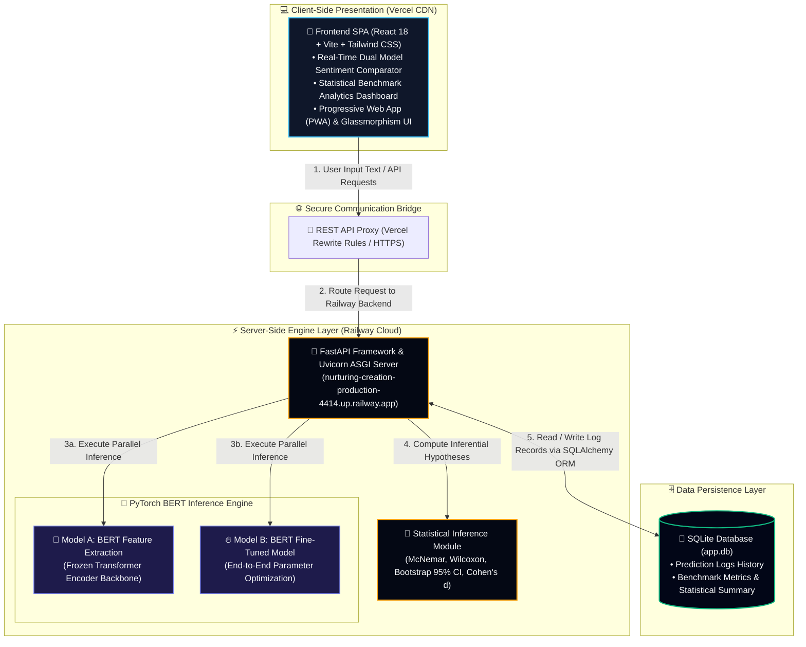

# 🎓 BERT Sentiment Lab & Research Benchmark Dashboard

[](https://nurturing-creation-production-4414.up.railway.app/api/health)
[](https://vercel.com/)
[](https://fastapi.tiangolo.com/)
[](https://pytorch.org/)
[](https://reactjs.org/)
[](https://tailwindcss.com/)
[](https://opensource.org/licenses/MIT)

**Laboratorium Penelitian Komparatif Sentiment Analysis Berbasis Deep Learning Transformer (BERT)**  
*Fakultas Ilmu Komputer dan Teknologi Informasi (FIKTI), Universitas Muhammadiyah Sumatera Utara (UMSU)*

🌐 **Live Backend API**: [`https://nurturing-creation-production-4414.up.railway.app`](https://nurturing-creation-production-4414.up.railway.app/api/health)

---

## 📌 Ringkasan Eksekutif & Abstrak Penelitian

Sistem ini dikembangkan sebagai platform riset eksperimental komparatif untuk menguji performa klasifikasi sentimen ulasan film menggunakan arsitektur **BERT (*Bidirectional Encoder Representations from Transformers*)**. Penelitian ini membandingkan dua paradigma komputasi utama:

1. **Model A (Feature Extraction / Frozen Backbone)**: Arsitektur BERT di mana seluruh lapisan *transformer encoder* dibekukan (*frozen*), dan hanya lapisan *classification head* linier yang dilatih.
2. **Model B (End-to-End Fine-Tuning)**: Arsitektur BERT di mana seluruh parameter jaringan (*backbone* + *head*) diperbarui secara penuh (*fine-tuned*) melalui propagasi balik.

Platform ini dilengkapi dengan **Dashboard Analisis Inferensial** yang mengintegrasikan pengujian hipotesis statistik ketat (*McNemar's Test*, *Wilcoxon Signed-Rank Test*, *Bootstrap 95% Confidence Interval*, dan *Cohen's d Effect Size*) dari **6 *random seed initializations*** ($N=6$, Seeds: `42`, `123`, `456`, `789`, `1011`, `1213`).

---

## 📊 Hasil Statistik & Metrik Evaluasi Utama

Berdasarkan pengujian eksperimental pada dataset validasi independen:

| Metrik Evaluasi | Model A (Feature Extraction) | Model B (Fine-Tuned) | P-Value / Statisik Inferensial | Interpretasi Akademik |
| :--- | :---: | :---: | :---: | :--- |
| **Akurasi Rata-rata ($\mu \pm \sigma$)** | $85.15\% \pm 0.93\%$ | **$91.61\% \pm 0.46\%$** | $p = 0.01562$ *(Wilcoxon)* | Peningkatan signifikan secara statistik ($p < 0.05$) |
| **F1-Score Rata-rata ($\mu \pm \sigma$)** | $86.01\% \pm 0.47\%$ | **$91.98\% \pm 0.35\%$** | $p = 0.01562$ *(Wilcoxon)* | Konsistensi presisi & recall tinggi |
| **Latency Inferensi Real-Time** | **$7.60\text{ ms}$** | $7.71\text{ ms}$ | $\Delta = +0.11\text{ ms}$ | Kecepatan inferensi hampir identik |
| **Uji Disagreement McNemar** | — | — | **$p = 1.48 \times 10^{-8}$** ($\chi^2 = 32.14$) | Perbedaan prediksi signifikan ($p < 0.001$) |
| **Bootstrap 95% Confidence Interval** | — | — | **$[+4.44\%, +8.83\%]$** | Rentang keunggulan akurasi Model B |
| **Ukuran Efek (Cohen's $d$)** | — | — | **$d = 14.45$** | *Extremely Large Effect Size* ($d > 0.8$) |

---

## 🏛️ Arsitektur Sistem & Spesifikasi Teknologi

Sistem dibangun menggunakan arsitektur decoupled *Micro-service REST API* modern dengan diagram alir (*flowchart*) sebagai berikut:



### **1. Backend Engine (`Python 3.10+` - Live di Railway)**
- **Framework**: `FastAPI` 0.110+ & `Uvicorn` ASGI Server.
- **Deep Learning**: `PyTorch` 2.0+ & Hugging Face `transformers`.
- **Database**: `SQLAlchemy` ORM & `SQLite3`.
- **Deployment**: Railway Cloud Environment (Nixpacks Engine).

### **2. Frontend Dashboard (`Node.js 18+` - Live di Vercel)**
- **Framework**: `React` 18 & `Vite` Build Tool.
- **Styling**: `Tailwind CSS` v3 dengan custom *Academic Glassmorphism UI tokens*.
- **Animasi & Transisi**: `Framer Motion`.
- **Iconography**: `Lucide React` Transparan HD.
- **Progressive Web App (PWA)**: Support instalasi aplikasi desktop/mobile native dengan Web Manifest.

---

## 📁 Struktur Direktori Repositori

```
BERT-Sentiment-Lab/
├── README.md                    # Dokumentasi Akademik Resmi
├── requirements.txt             # Dependencies Python Backend
├── Procfile                     # Deployment Script Railway
├── nixpacks.toml                # Configuration Build Railway Nixpacks
├── vercel.json                  # Proxy Rewrite Config Vercel
├── app.db                       # Database SQLite Log Riwayat
├── Experiment_Notebook.ipynb    # Notebook Eksperimen (6 Random Seeds)
│
├── backend/                     # Python FastAPI Backend Engine
│   ├── requirements.txt
│   └── app/
│       ├── database.py          # Session & Engine Connection
│       ├── engine.py            # PyTorch Model Execution Engine
│       ├── init_db.py           # Database Seeding & Initialization
│       ├── main.py              # REST API Route Definitions
│       ├── models.py            # SQLAlchemy Database Models
│       └── schemas.py           # Pydantic Input/Output Schemas
│
└── frontend/                    # React Vite Web Application
    ├── package.json             # NPM Dependencies & Scripts
    ├── index.html               # Entry HTML & PWA Icons Meta
    ├── vercel.json              # Configuration Proxy Rewrite Rules
    ├── vite.config.js           # Vite Server & Proxy Setup
    ├── public/
    │   ├── favicon.png          # Transparent Favicon Icon
    │   ├── manifest.json        # PWA Web Manifest Configuration
    │   └── icons/               # High-Resolution PWA Icons
    └── src/
        ├── App.jsx              # Main Layout, RBAC Guard, PWA Modal
        ├── index.css            # Custom Design System & CSS Variables
        └── components/
            ├── Comparator.jsx   # Real-Time Dual Model Inferensi Panel
            └── Analytics.jsx    # Benchmark Inferensial Dashboard Panel
```

---

## ⚡ Petunjuk Instalasi & Replikasi Lokal

### **1. Kloning Repositori**
```bash
git clone https://github.com/khamalputra/BERT-Sentiment-Lab.git
cd BERT-Sentiment-Lab
```

### **2. Setup Backend FastAPI Engine**
```bash
# Buat dan aktifkan Virtual Environment Python
python -m venv .venv

# Windows PowerShell:
.\.venv\Scripts\Activate.ps1

# Linux / MacOS:
source .venv/bin/activate

# Install dependencies
pip install -r requirements.txt

# Inisialisasi Database SQLite
python -m backend.app.init_db

# Jalankan Backend Server
python -m uvicorn backend.app.main:app --port 8000 --reload
```
> Backend API dapat diakses di: `http://127.0.0.1:8000` (Dokumentasi Swagger UI: `http://127.0.0.1:8000/docs`).

### **3. Setup Frontend React Dashboard**
Buka terminal baru di folder proyek:
```bash
cd frontend

# Install Node Modules
npm install

# Jalankan Vite Development Server
npm run dev
```
> Aplikasi Web Dashboard dapat diakses di: `http://localhost:5173`

---

## 📄 Hak Cipta & Sitasi Akademik

Jika Anda menggunakan repositori ini atau data eksperimen dalam penelitian Anda, silakan berikan sitasi sebagai berikut:

```bibtex
@thesis{Hasan2026BERTSentiment,
  author       = {Syafiq Hasan},
  title        = {Analisis Komparatif Performansi Klasifikasi Sentimen Arsitektur BERT Feature Extraction vs Fine-Tuning Berbasis Pengujian Hipotesis Statistik Inferensial},
  school       = {Fakultas Ilmu Komputer dan Teknologi Informasi (FIKTI), Universitas Muhammadiyah Sumatera Utara (UMSU)},
  year         = {2026},
  type         = {Skripsi / Tugas Akhir},
  npm          = {2209010182}
}
```

---
*Developed with ❤️ by Syafiq Hasan (FIKTI UMSU - 2026)*
